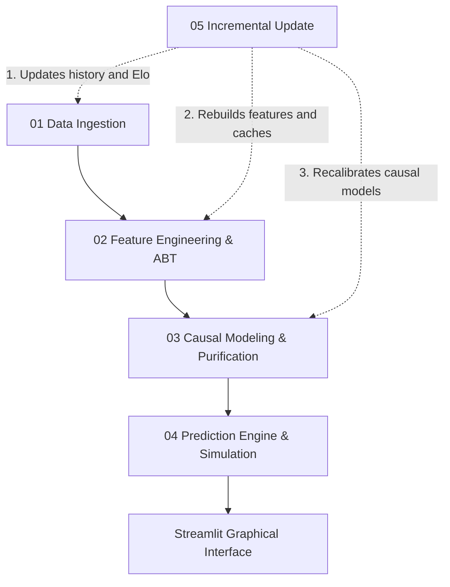

# World Cup Causal Predictor

A model for simulating and predicting 2026 World Cup matches using **Causal Inference** and **Data Engineering** techniques. This project was developed by combining statistical rigor, causal modeling, and data-centric software architecture, with the goal of isolating noise and predicting the real probability of scores and results in elite football.

This project arose from the bold idea of—just one week before the 2026 World Cup—a football lover like me applying some ideas and studies I had been exploring in Data Science to create a model that would attempt to predict not just winners, but the exact scores of World Cup matches. It was an experience of not only technical learning, but of knowing how to adjust the project during the real scenario of application, modeling new shapes and improving the model with immediate and real feedback.

---

## 📌 Table of Contents

- [🧠 Project Differentiator: Why Causal Inference?](#-project-differentiator-why-causal-inference)
- [⚡ Main Features](#-main-features)
- [🏆 Main Results](#-main-results)
- [🏗️ Architecture and Data Flow](#️-architecture-and-data-flow)
- [📁 Repository Structure](#-repository-structure)
- [🛠️ Technologies Used](#️-technologies-used)
- [🚀 How to Run the Project](#-how-to-run-the-project)
- [📊 Modeling Summary (Under the Hood)](#-modeling-summary-under-the-hood)
- [🤖 AI-Assisted Development](#-ai-assisted-development)
- [🔒 Private Repository](#-private-repository)

---

## 🧠 Project Differentiator: Why Causal Inference?

Traditional Machine Learning models focus only on finding predictive patterns. However, in football, matches are polluted by multiple **confounding factors (confounders)** that mask a team's true strength (e.g., asymmetric schedules, confederation difficulty levels, logistical stress).

To solve the problem of data bias, this project uses **Causal Inference** to **purify the intrinsic strength** of national teams:

1. The domain was modeled using a **Directed Acyclic Graph (DAG)**, strictly mapping cause-and-effect relationships.
2. Structural confounding variables were identified to apply the **Backdoor Criterion** using the `DoWhy` library, mathematically isolating the impact of each confederation.
3. Pure offensive and defensive coefficients were extracted via Poisson Regression, adjusted by an exponential time decay to prioritize the recent technical phase.
4. The **Heterogeneous Treatment Effects (HTE)** of different tactical shocks (e.g., Possession vs. Transition) were measured via a Meta-Learner (**X-Learner** from the `CausalML` library).

Thus, the simulator is based on the **purified strength** of the teams, injecting friction variables (weather, knockout tension) in a controlled manner only during the inference phase.

---

## ⚡ Main Features

- **Dixon-Coles Probabilistic Engine:** Custom calibration on Poisson regression to correct the chronic underestimation of low-scoring draws (0-0, 1-1) typical of basic statistical models.
- **Environmental Shock Module:** Algorithm that calculates the athlete's homeostatic disruption by comparing weather and altitude conditions at the match location with the geographical baseline of the team's country of origin.
- **Game State Intervener (Human-in-the-Loop):** A module designed to incorporate specific scenarios based on human analysis and football criticism. It handles complex situations—such as mathematical possibilities in the final round of the group stage or the behavior of underdogs in the knockout stage—by introducing dynamic multipliers to the offensive and defensive matrices that self-adjust through a basic learning algorithm, yielding highly accurate predictions and incredible results.
- **Incremental MLOps Pipeline:** Script designed for continuous ingestion, recalculation of temporal features, and automatic retraining of causal models after each completed round.

---

## 🏆 Main Results

The model was tested in a real-world scenario (production) during the World Cup, operating in parallel with the tournament. By isolating human bias and operating strictly under the recommendations of the probabilistic engine, the architecture proved its statistical value.

### 📊 General Results Data

Below are the detailed accuracy figures achieved by the **Probabilistic Mode (Joint Mode)**, estimating the highest joint probability using the Dixon-Coles matrix:

| Metric | All Matches (102 matches) | Knockout Stage (30 matches) |
| :--- | :---: | :---: |
| **Exact Scores** | 13.7% | 23.3% |
| <mark>**Outcomes (W/D/L)**</mark> | <mark>**70.6%**</mark> | <mark>**86.7%**</mark> |
| **Winner's Goals** | 28.2% | 46.2% |
| **Loser's Goals** | 48.7% | 50.0% |
| **MAE in Winner's Goals** | 1.05 | 0.58 |
| **MAE in Loser's Goals** | 0.64 | 0.62 |
| **Goal Difference** | 28.4% | 33.3% |
| **Total Goals Scored** | 24.5% | 33.3% |

### 🔍 Curious Results & Trivia

- **Brazilian National Team:** We nailed the exact score in 3 out of the 5 matches played by Brazil (our country).
- **Round of 32:** We predicted the exact score of 1/4 (25%) of the matches in this knockout stage.
- **Tough Semifinal Matches:** In the tough semifinal matches, the model nailed Argentina's 2-1 victory over England and predicted Spain's win by scoring exactly 2 goals against the favorite France.
- **Flawless Quarterfinals:** We predicted the correct outcome (W/D/L) of all quarterfinal matches, nailing the exact scores for half of them.
- **Evolution and Learning:** The model demonstrated an excellent capability to adapt and learn quickly. While the outcome accuracy in the 1st round of the group stage was 50%, it rose to 70.8% in rounds 2 and 3.

---

## 🏗️ Architecture and Data Flow

The data cycle operates in five chained phases:



---

## 📁 Repository Structure

Modular architecture split between data orchestration, inference, interface, and quality assurance (Tests):

```text
worldcup_causal_predictor/
├── 📂 .streamlit/          # Layout and theme settings for the Streamlit UI
├── 📂 data/                # Raw data, processed bases, and saved Elo states
│   ├── 📂 models/          # Calibrated parameters and X-Learner HTE matrix
│   ├── 📂 processed/       # Analytical Base Table (ABT) and local caches (weather/coordinates)
│   ├── 📂 raw/             # Raw datasets and historical backups
│   └── predictions.csv     # Historical log of user-saved predictions
├── 📂 pages/               # Streamlit application pages
│   ├── dashboard.py        # Analytical dashboard for Elo statistics and evolution
│   ├── interventor.py      # Panel for custom scenarios in Round 3
│   ├── pontuacao.py        # Real-time tracking and scoring panel for the sweepstake
│   └── predicao.py         # Main matchup simulator and shocks panel
├── 📂 scripts/             # Data pipeline and statistical modeling scripts
│   ├── 01_data_ingestion.py   # Ingestion of historical data, StatsBomb, Transfermarkt, and Elo
│   ├── 02_feature_engineering.py # ABT creation, tactical clusters, and weather shocks
│   ├── 03_causal_modeling.py  # Causal modeling (DAG, Backdoor, Poisson, and HTE X-Learner)
│   ├── 04_prediction_engine.py # Inference engine (Dixon-Coles, Super Lock, Scenarios)
│   ├── 05_incremental_update.py # Incremental update pipeline and auto-retraining
│   ├── stats_helper.py     # Mathematical and statistical utility functions
│   └── utils.py            # General support functions (I/O, logs, caches)
├── 📂 test/                # Automated test suite with pytest
│   ├── test_abt.py         # ABT attribute quality and generation tests
│   ├── test_dixon_coles.py # Mathematical tests for Dixon-Coles correction
│   ├── test_pipeline.py    # Unit tests for ingestion pipeline and Elo
│   ├── test_predictions.py # Tests for prediction engine and modifiers
│   └── test_scenarios.py   # Tests for Scenario Intervener heuristics
├── app.py                  # Streamlit application entry point
├── Makefile                # Task automation and project execution
├── PIPELINE.md             # Detailed mathematical and technical pipeline documentation
└── requirements.txt        # Python library dependencies
```

---

## 🛠️ Technologies Used

| Category | Technologies / Libraries |
| --- | --- |
| **Causal Inference & Statistics** | `DoWhy`, `CausalML` (X-Learner), `Statsmodels` |
| **Machine Learning** | `scikit-learn`, `XGBoost` |
| **Data Engineering & APIs** | `pandas`, `numpy`, `pyarrow`, `soccerdata`, `Open-Meteo API`, `StatsBomb API` |
| **User Interface (Web)** | `Streamlit` |
| **Quality & Deployment** | `pytest`, `Makefile`, `Docker` *(implicit in orchestration)* |

---

## 🚀 How to Run the Project

### Prerequisites

* Python 3.10+
* Configured virtual environment

### Main Commands (via Makefile)

* `make run-app`: Starts the graphical interface.
* `make update`: Runs the complete delta extraction cycle and causal model retraining.
* `make test`: Executes the statistical and structural validation suite.

### UI Features

The Streamlit UI of the project is split into four specialized panels accessible via the sidebar:

* **1. Prediction:** Allows simulating any direct matchup between World Cup teams. Here you can parameterize tactical styles, activate the *Super Lock* modifier, simulate weather/altitude shocks, and view the joint probability matrix of scores.
* **2. Dashboard:** Displays exploratory data analysis of the model's accuracy rates in the 2026 World Cup, providing various statistics on saved guesses.
* **3. Scoring Panel:** Tracks the progress of your bets (Sweepstakes) in real-time using a gamified scoring system.
* **4. Scenario Intervener:** Forces specific behaviors for typical group stage final scenarios (Round 3), adjusting the draw factor and goal expectations.

---

## 📊 Modeling Summary (Under the Hood)

* **Continuous Elo Rating:** Team strengths are not static. The pipeline ingests the entire international history, applying adaptive weighting factors linked to competition relevance.
* **Tactical Clustering:** Team profiles are grouped using unsupervised algorithms (K-Means) fed not only by goals, but by underlying aggressiveness and retention metrics (PPDA, passes in the final third).
* **Time-Decayed Poisson:** The central regression uses optimized exponential decay functions, ensuring the model is highly reactive to recent performance disruptions but resilient to single-game anomalies.

---

## 🤖 AI-Assisted Development

This repository was built adopting modern *AI Pair Programming* methodologies. Artificial intelligence acted as a co-pilot in architectural refactoring, DAG definition, and statistical calibration, optimizing the Research & Development (R&D) cycle and ensuring high modularity in production code.

---

## 🔒 Private Repository

Due to the high predictive performance achieved by this model in a real-world scenario (2026 World Cup) and the practical potential of its proprietary logic—such as causal data purification, probabilistic adjustments based on human scenarios (Human-in-the-Loop), and temporal calibration hyperparameters—the source code of this project is kept private and restricted.

This open documentation aims to present the architecture, methodological rigor, and engineering decisions behind the pipeline. If you are a researcher, recruiter, or have commercial interest in structured football data applications, feel free to contact me for a frank and detailed conversation on how the project works internally.
