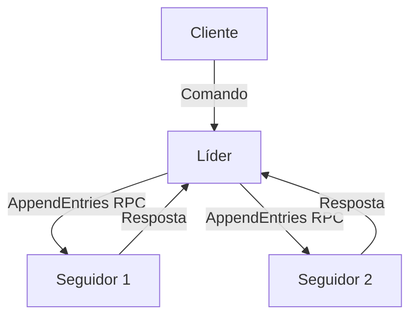

## Visão Geral

Este projeto consiste em uma implementação robusta em Go do algoritmo de consenso distribuído Raft. O Raft é projetado para gerenciar logs replicados de forma compreensível e segura, garantindo que um cluster de servidores tome decisões consistentes mesmo diante de falhas de hardware ou partições de rede.

## Motivação

Sistemas distribuídos são notoriamente difíceis de depurar e garantir corretude. A motivação principal foi implementar o algoritmo de consenso Raft do zero, focando nas etapas cruciais de eleição de líder e segurança de replicação para entender a fundo problemas clássicos de concorrência e estado compartilhado.

## Arquitetura

O sistema é implementado utilizando uma arquitetura baseada em goroutines concorrentes e comunicação via gRPC:

## Resultados

- Eleição automática e segura de novo líder em menos de 150ms após falhas.
- Replicação consistente de estado sob partições de rede agressivas.
- Implementação completa de compactação de logs através de snapshots de estado.
