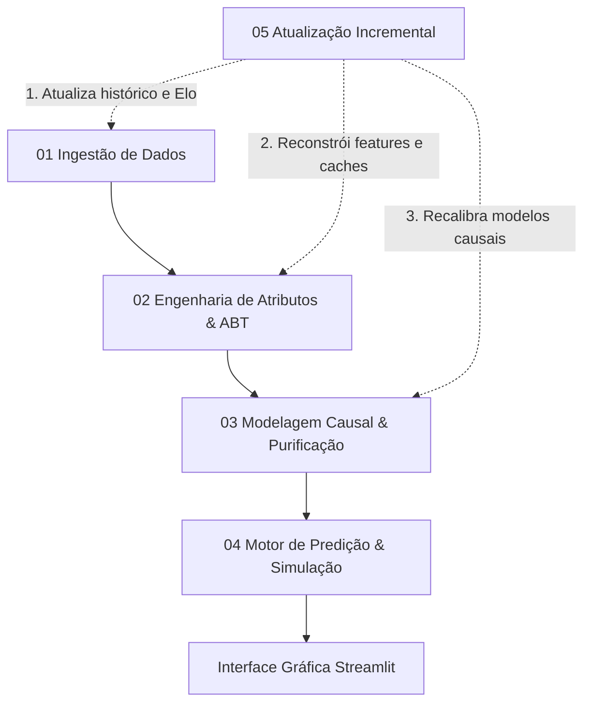

# World Cup Causal Predictor

Modelo para simulação e previsão dos jogos da Copa do Mundo de 2026 utilizando técnicas de **Inferência Causal** e **Engenharia de Dados**. Este projeto foi desenvolvido combinando rigor estatístico, modelagem causal e arquitetura de software orientada a dados (_data-centric_), com o objetivo de isolar ruídos e prever a probabilidade real de placares e resultados no futebol de elite.

Esse projeto surgiu na ideia ousada de, apenas uma semana antes da Copa do Mundo 2026, um apaixonado por futebol como eu aplicar algumas ideias e estudos que vinha explorando na área de Ciência de Dados para criar um modelo que tentasse acertar não só vencedores, mas placares de jogos da Copa do Mundo. Foi uma experiência não só de aprendizado técnico, mas de saber ajustar o projeto durante o cenário real de aplicação, modelando novas formas e melhorando o modelo com feedback imediato e real.

---

## 📌 Índice

- [🧠 Diferencial do Projeto: Por que Inferência Causal?](#-diferencial-do-projeto-por-que-inferência-causal)
- [⚡ Funcionalidades Principais](#-funcionalidades-principais)
- [🏆 Principais Resultados](#-principais-resultados)
- [🏗️ Arquitetura e Fluxo de Dados](#️-arquitetura-e-fluxo-de-dados)
- [📁 Estrutura do Repositório](#-estrutura-do-repositório)
- [🛠️ Tecnologias Utilizadas](#️-tecnologias-utilizadas)
- [🚀 Como Rodar o Projeto](#-como-rodar-o-projeto)
- [📊 Resumo da Modelagem (Under the Hood)](#-resumo-da-modelagem-under-the-hood)
- [🤖 Desenvolvimento Assistido por IA](#-desenvolvimento-assistido-por-ia)
- [🔒 Repositório Privado](#-repositório-privado)

---

## 🧠 Diferencial do Projeto: Por que Inferência Causal?

Modelos tradicionais de Machine Learning focam apenas em encontrar padrões preditivos. No entanto, no futebol, as partidas são poluídas por múltiplos **fatores de confusão (confounders)** que mascaram a verdadeira força de uma equipe (ex: calendários assimétricos, nível de dificuldade da confederação, estresse logístico).

Para resolver o problema do viés de dados, este projeto utiliza a **Inferência Causal** para **purificar a força intrínseca** das seleções:

1. O domínio foi modelado através de um **Grafo Acíclico Dirigido (DAG)**, mapeando estritamente relações de causa e efeito.
2. Variáveis de confusão estruturais foram identificadas para aplicação do **Critério Backdoor** utilizando a biblioteca `DoWhy`, isolando matematicamente o impacto de cada confederação.
3. Os coeficientes puros de Ataque e Defesa foram extraídos via Regressão de Poisson, ajustados por um decaimento temporal exponencial para priorizar a fase técnica recente.
4. Os **Efeitos de Tratamento Heterogêneos (HTE)** de diferentes choques táticos (ex: Posse vs. Transição) foram mensurados via Meta-Learner (**X-Learner** da biblioteca `CausalML`).

Dessa forma, o simulador baseia-se na **força purificada** das equipes, injetando as variáveis de fricção (clima, tensão de mata-mata) de forma controlada apenas na etapa de inferência.

---

## ⚡ Funcionalidades Principais

- **Motor Probabilístico de Dixon-Coles:** Calibração customizada sobre a regressão de Poisson para corrigir a subestimação crônica de empates de baixo placar (0x0, 1x1) típica de modelos estatísticos básicos.
- **Módulo de Choque Ambiental:** Algoritmo que calcula a quebra de homeostase dos atletas comparando as condições meteorológicas e de altitude do local da partida com a baseline geográfica histórica do país de origem da seleção.
- **Interventor de Game State (Teoria dos Jogos):** Modificadores dinâmicos que ajustam matrizes ofensivas e defensivas de acordo com incentivos do regulamento (ex: necessidade de saldo de gols, ou zebras buscando disputas de pênaltis).
- **Pipeline MLOps Incremental:** Script arquitetado para ingestão contínua, recálculo de features temporais e retreino automático dos modelos causais a cada nova rodada completada.

---

## 🏆 Principais Resultados

O modelo foi submetido a teste em cenário real (produção) durante a Copa do Mundo, operando de forma paralela ao torneio. Isolando o viés humano e operando estritamente sobre as recomendações do motor probabilístico, a arquitetura provou seu valor estatístico:

* **Precisão Global (101 Jogos):** O modelo obteve **70.3% de acerto na direção do resultado (V/E/D)** em toda a base de partidas simuladas do torneio.
* **Elite Preditiva no Mata-Mata:** Nas fases eliminatórias (29 jogos), a assertividade da purificação causal do modelo saltou para **86.2% de precisão (V/E/D)**.
* **Impacto da Moda Conjunta (Placares Exatos):** Operando sob o ajuste de Dixon-Coles, a arquitetura cravou **21.4% de placares exatos** em jogos de mata-mata.
* **Redução de Erro Absoluto:** O *Mean Absolute Error (MAE)* de gols calculados para o time vencedor no mata-mata foi de apenas **0.60**, atestando o rigoroso controle sobre a sobredispersão de gols em fases finais.

---

## 🏗️ Arquitetura e Fluxo de Dados

O ciclo de dados opera em cinco fases encadeadas:



---

## 📁 Estrutura do Repositório

Arquitetura modular dividida entre orquestração de dados, inferência, interface e garantia de qualidade (Testes):

```text
worldcup_causal_predictor/
├── 📂 .streamlit/          # Configurações de layout e tema da interface Streamlit
├── 📂 data/                # Dados brutos, bases processadas e estados salvos do Elo
│   ├── 📂 models/          # Parâmetros calibrados e matriz HTE do X-Learner
│   ├── 📂 processed/       # Tabela Analítica Base (ABT) e caches locais (clima/coordenadas)
│   ├── 📂 raw/             # Bases de dados brutas e backups históricos
│   └── predictions.csv     # Registro histórico de predições salvas pelo usuário
├── 📂 pages/               # Páginas da aplicação Streamlit
│   ├── dashboard.py        # Dashboard analítico de estatísticas e evolução do Elo
│   ├── interventor.py      # Painel para cenários customizados da Rodada 3
│   ├── pontuacao.py        # Painel de acompanhamento e pontuação do Bolão
│   └── predicao.py         # Simulador principal de confrontos direto e choques
├── 📂 scripts/             # Scripts do pipeline de dados e modelagem estatística
│   ├── 01_data_ingestion.py   # Ingestão de dados históricos, StatsBomb, Transfermarkt e Elo
│   ├── 02_feature_engineering.py # Criação da ABT, clusters táticos e choques climáticos
│   ├── 03_causal_modeling.py  # Modelagem causal (DAG, Backdoor, Poisson e HTE X-Learner)
│   ├── 04_prediction_engine.py # Motor de inferência (Dixon-Coles, Super Ferrolho, Cenários)
│   ├── 05_incremental_update.py # Pipeline de atualização incremental e retreino automático
│   ├── stats_helper.py     # Funções utilitárias de suporte matemático e estatístico
│   └── utils.py            # Funções de suporte geral (I/O, logs, caches)
├── 📂 test/                # Suíte de testes automatizados com pytest
│   ├── test_abt.py         # Testes de geração e qualidade dos atributos da ABT
│   ├── test_dixon_coles.py # Testes matemáticos de correção Dixon-Coles
│   ├── test_pipeline.py    # Testes unitários do pipeline de ingestão e Elo
│   ├── test_predictions.py # Testes do motor de simulação e modificadores
│   └── test_scenarios.py   # Testes das heurísticas do Interventor de Cenários
├── app.py                  # Ponto de entrada do aplicativo Streamlit
├── Makefile                # Automação de tarefas e execução do projeto
├── PIPELINE.md             # Documentação matemática e técnica detalhada do pipeline
└── requirements.txt        # Dependências de bibliotecas Python

```

---

## 🛠️ Tecnologias Utilizadas

| Categoria | Tecnologias / Bibliotecas |
| --- | --- |
| **Inferência Causal & Estatística** | `DoWhy`, `CausalML` (X-Learner), `Statsmodels` |
| **Machine Learning** | `scikit-learn`, `XGBoost` |
| **Data Engineering & APIs** | `pandas`, `numpy`, `pyarrow`, `soccerdata`, `Open-Meteo API`, `StatsBomb API` |
| **Interface de Usuário (Web)** | `Streamlit` |
| **Qualidade & Deploy** | `pytest`, `Makefile`, `Docker` *(implícito na orquestração)* |

---

## 🚀 Como Rodar o Projeto

### Pré-requisitos

* Python 3.10+
* Ambiente virtual configurado

### Comandos Principais (via Makefile)

* `make run-app`: Inicia a interface gráfica.
* `make update`: Roda o ciclo completo de extração delta e retreino do modelo causal.
* `make test`: Executa a suíte de validação estatística e estrutural.

### Recursos de Interface

A interface Streamlit do projeto divide-se em quatro painéis especializados acessíveis pelo menu lateral:

* **1. Predição:** Permite simular qualquer confronto direto entre seleções da Copa do Mundo. Nela é possível parametrizar os estilos táticos de jogo, ativar o modificador *Super Ferrolho*, simular choques de clima/altitude e visualizar a matriz completa de probabilidade conjunta de placares.
* **2. Dashboard:** Exibe análise exploratória de dados das taxas de acerto do modelo no contexto da Copa do Mundo 2026, fornecendo diversas estatísticas sobre os palpites salvos.
* **3. Painel de Pontuação:** Acompanha o progresso de suas apostas (Bolão) em tempo real, usando um sistema de pontuação "gamificado".
* **4. Interventor de Cenários:** Força comportamentos específicos para cenários típicos de final de fase de grupos (Rodada 3), ajustando o fator de empates e a expectativa de gols.

---

## 📊 Resumo da Modelagem (Under the Hood)

* **Continuous Elo Rating:** As forças das seleções não são estáticas. O pipeline ingere todo o histórico internacional, aplicando fatores de peso adaptativos atrelados à relevância da competição.
* **Clustering Tático:** O perfil das equipes é agrupado por algoritmos não-supervisionados (K-Means) alimentados não apenas por gols, mas por métricas subjacentes de agressividade e retenção (PPDA, passes no terço final).
* **Time-Decayed Poisson:** A regressão central utiliza funções de decaimento exponencial otimizadas, garantindo que o modelo seja altamente reativo a rupturas de rendimento recente, mas resiliente a anomalias de jogo único.

---

## 🤖 Desenvolvimento Assistido por IA

Este repositório foi construído adotando metodologias modernas de *AI Pair Programming*. Inteligência artificial atuou como co-piloto na refatoração arquitetural, definição do DAG e calibração estatística, otimizando o ciclo de *Research & Development* (R&D) e garantindo alta modularidade no código de produção.

---

## 🔒 Repositório Privado

Devido ao alto desempenho preditivo alcançado por este modelo em um cenário real (Copa do Mundo de 2026) e ao potencial prático de suas lógicas proprietárias — como a purificação causal de dados, ajustes probabilísticos para a Teoria dos Jogos e os hiperparâmetros de calibração temporal —, o código-fonte deste projeto está mantido de forma restrita e privada.

Esta documentação aberta tem o objetivo de apresentar a arquitetura, o rigor metodológico e as decisões de engenharia por trás do pipeline. Caso você seja um pesquisador, recrutador ou possua interesse em aplicações comerciais baseadas em dados estruturados de futebol, sinta-se à vontade para entrar em contato comigo para uma conversa franca e detalhada sobre o funcionamento interno do projeto.

```
